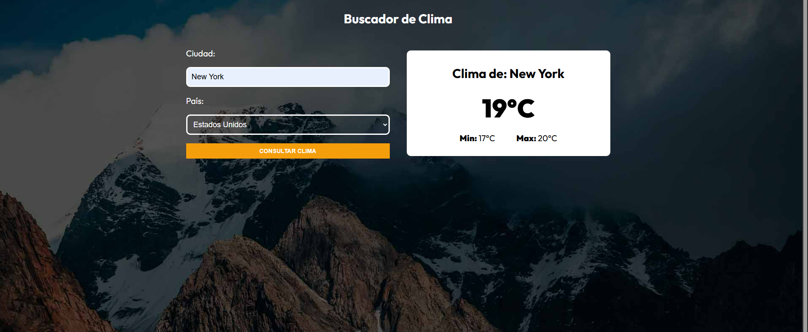

# 🌤️ Weather App - Buscador de Clima

Aplicación web desarrollada con **React + TypeScript** que permite consultar el clima actual de cualquier ciudad del mundo en tiempo real, consumiendo la API de [OpenWeatherMap](https://openweathermap.org/).

## 🚀 Tecnologías utilizadas

- ⚛️ **React** (con Vite o CRA, según setup)
- 🟦 **TypeScript**
- 🎨 **CSS Modules** para estilos encapsulados
- 🌐 **OpenWeatherMap API** para obtener datos del clima

## 📸 Vista previa

## ⚙️ Funcionalidades

- Búsqueda de clima por **ciudad** y **país**.
- Muestra:
  - 🌡️ Temperatura actual.
  - 🔻 Temperatura mínima.
  - 🔺 Temperatura máxima.
- Interfaz sencilla y responsive.

## 🔑 Configuración

Para poder usar la aplicación, necesitas una API Key de [OpenWeatherMap](https://openweathermap.org/api).

1. Regístrate en la plataforma.
2. Obtén tu **API Key**.
3. Configura la variable de entorno en tu proyecto:

## 🚀 Deployment
[URL](https://buscador-clima-react-sarapatino.netlify.app/)
